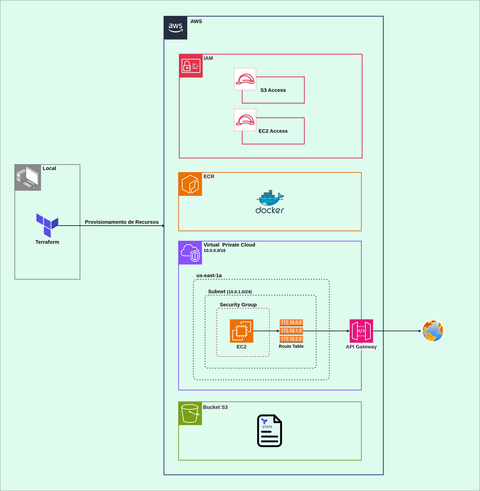

# Provisionamento de infraestrutura AWS utilizando Terraform

O projeto tem como objetivo provisionar uma infraestrutura na AWS utilizando Terraform, criando um ambiente capaz de disponibilizar um website na internet de forma estruturada e segura.

Os serviços da AWS utilizados no projeto são:

* Amazon EC2
* Amazon ECR
* Amazon VPC
* Amazon S3
* AWS IAM
* Security Groups
* Route Tables
* Internet Gateway

Além disso, foram utilizadas as seguintes tecnologias e ferramentas:

* Terraform
* Docker
* Linux

O projeto foi desenvolvido com finalidade de estudo e prática de Infrastructure as Code (IaC), utilizando como referências a documentação oficial do Terraform, a documentação oficial da AWS, materiais técnicos e outros recursos de estudo.

A infraestrutura foi provisionada em um ambiente real da AWS, permitindo validar na prática a criação, configuração, comunicação e gerenciamento dos recursos utilizando Terraform.

<!--  -->


```
terraform-aws-website-infrastructure/
|
├── bucket-cration
|   |
|   ├── main.tf
|   ├── provider.tf
|   └── resource.tf
|
└── terraform-aws-vpc-iam-ec2-ecs
    │
    ├── modules/
    │   ├── ec2/
    │   │   ├── resource.tf
    │   │   └── variable.tf
    │   │
    │   ├── ecr/
    │   │   └── resource.tf
    │   │
    │   ├── iam/
    │   │   ├── data.tf
    │   │   ├── output.tf
    │   │   ├── resource.tf
    │   │   └── variables.tf
    │   │
    │   └── vpc/
    │       ├── output.tf
    │       ├── security_group.tf
    │       └── vpc.tf
    │
    ├── backend.tf
    ├── main.tf
    ├── module.tf
    └── provider.tf
```


# Infraestrutura provisionada

O Terraform realiza a criação de recursos e configurações da AWS, incluindo serviços, regras de acesso e associações necessárias para disponibilizar a infraestrutura.

Abaixo estão descritas as responsabilidades dos principais recursos utilizados no projeto.

## EC2

Responsável pela criação da instância em que a aplicação será executada. O recurso `aws_instance` utiliza uma AMI e um tipo de instância definidos na configuração do Terraform. Neste projeto, foi utilizada uma AMI Linux (`ami-0bdc7d025135d7b49`) e uma instância `t3.micro`.

Para acessar a instância via SSH, é necessária uma Key Pair. Neste projeto, o Terraform utiliza o provider `TLS` para gerar uma chave RSA de 4096 bits e o recurso `aws_key_pair` para registrar a chave pública na AWS.

O recurso `local_file` salva automaticamente a chave privada no diretório raiz do projeto, utilizando a extensão `.pem` e a permissão `0400`, adequada para utilização em ambientes Linux.

A EC2 também precisa estar associada a uma subnet, que fornece o endereço IP privado dentro da VPC. Além disso, a instância recebe um `IAM Instance Profile`, permitindo que ela assuma uma IAM Role e tenha acesso aos recursos da AWS necessários para a execução da aplicação.

Neste projeto, a EC2 utiliza a IAM Role para acessar o Amazon ECR e realizar o download da imagem Docker da aplicação.

## ECR

O Amazon Elastic Container Registry (ECR) é utilizado para armazenar as imagens Docker da aplicação.

A EC2 possui permissão de leitura no repositório ECR por meio da IAM Role associada à instância. Dessa forma, a aplicação pode ser disponibilizada na EC2 a partir de uma imagem armazenada no repositório.

## IAM

O AWS Identity and Access Management (IAM) é responsável pelo gerenciamento de identidades e permissões na AWS.

Neste projeto, é criada uma IAM Role destinada à EC2. A Role possui uma política de confiança que permite que o serviço EC2 a assuma.

A Role recebe permissões para acessar o Amazon ECR, permitindo que a instância obtenha as imagens Docker necessárias para executar a aplicação.

Também é configurada uma política de acesso ao S3 para permitir as operações necessárias sobre o bucket utilizado pelo projeto.

A associação entre a Role e a EC2 é realizada por meio de um `aws_iam_instance_profile`.

## VPC

A Amazon Virtual Private Cloud (VPC) é responsável pela criação da rede virtual onde os recursos do projeto são executados.

Neste projeto, a VPC utiliza o bloco CIDR `10.0.0.0/16`, disponibilizando um espaço de endereçamento privado que pode conter até 65.536 endereços IPv4.

Dentro da VPC é criada uma subnet pública utilizando o bloco `10.0.1.0/24`. Essa subnet possui aproximadamente 256 endereços IPv4, sendo alguns deles reservados pela AWS.

A EC2 é provisionada dentro dessa subnet e recebe um endereço IP privado pertencente ao intervalo definido pela subnet.

### Internet Gateway

O Internet Gateway permite a comunicação entre a VPC e a Internet.

Ele é associado à VPC e utilizado pela Route Table para encaminhar o tráfego destinado à Internet.

### Route Table

A Route Table define como o tráfego da subnet deve ser encaminhado.

Neste projeto, é criada uma rota padrão:

```
0.0.0.0/0 → Internet Gateway
```

Essa configuração permite que o tráfego destinado a endereços externos seja encaminhado para o Internet Gateway.

A Route Table é associada à subnet por meio do recurso `aws_route_table_association`.

### Security Groups

O Security Group controla o tráfego de entrada e saída associado à interface de rede da EC2.

Neste projeto, são configuradas as seguintes regras de entrada:

* **SSH (porta 22):** permitido somente a partir do endereço IP da máquina utilizada para administrar a EC2.
* **HTTP (porta 80):** acesso público.
* **HTTPS (porta 443):** acesso público.

O tráfego de saída é permitido para qualquer destino:

```
0.0.0.0/0
```

Dessa forma, a EC2 pode realizar conexões externas necessárias para a execução da aplicação.

## Subnet

A subnet representa uma divisão da rede definida pela VPC.

Neste projeto, a subnet utiliza o bloco:

```
10.0.1.0/24
```

Ela está configurada como subnet pública, possui associação com a Route Table que direciona o tráfego externo para o Internet Gateway e permite que instâncias EC2 obtenham um endereço IP público automaticamente.

## Módulos Terraform

A infraestrutura foi organizada em módulos Terraform de acordo com a responsabilidade de cada conjunto de recursos:

```
modules/
├── ec2/
├── ecr/
├── iam/
└── vpc/
```

Essa organização permite separar as responsabilidades da infraestrutura e facilita a manutenção e evolução do projeto.

## Execução

O projeto pode ser executado utilizando os comandos padrão do Terraform.

Antes da execução, é necessário informar o endereço IP da máquina que será utilizada para acessar a EC2 via SSH na regra correspondente do Security Group.

O endereço IP público pode ser obtido através do comando:

```
$ curl ifconfig.me
```

O endereço deve ser informado utilizando a notação CIDR `/32`.

### Inicialização

Inicializa o Terraform e instala os providers necessários:

```
$ terraform init
```

### Validação

Valida a configuração do Terraform:

```
$ terraform validate
```

### Planejamento

Exibe as alterações que serão realizadas na infraestrutura:

```
$ terraform plan
```

### Provisionamento

Aplica as alterações e cria os recursos na AWS:

```
$ terraform apply
```

### Destruição da infraestrutura

Ao finalizar os testes, é importante destruir os recursos provisionados, principalmente quando o projeto é executado em uma conta AWS real, pois determinados recursos podem gerar custos.

Para remover os recursos gerenciados pelo Terraform:

```
$ terraform destroy
```

O comando deve ser utilizado somente quando não houver necessidade de manter os recursos criados pelo projeto.

